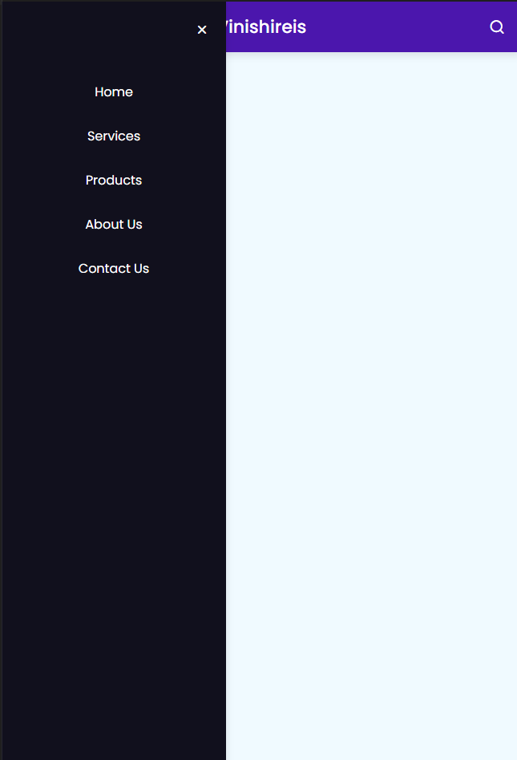

# Responsive Nav Bar

A codepen on Vinishireis

Este projeto é uma barra de navegação responsiva criada com HTML, CSS e JavaScript.

## Visão Geral

A barra de navegação é responsiva e se adapta a diferentes tamanhos de tela, proporcionando uma experiência de usuário consistente em dispositivos móveis e desktop. Utiliza HTML para a estrutura, CSS para o estilo e JavaScript para a funcionalidade.

## Funcionalidades

- **Responsividade:** A barra de navegação se ajusta automaticamente para diferentes tamanhos de tela.
- **Menu Hambúrguer:** Em telas menores, a barra de navegação é convertida em um menu hambúrguer.
- **Links de Navegação:** Links que podem ser personalizados de acordo com a necessidade do projeto.
- **Efeitos de Estilo:** Animações e transições suaves para uma melhor experiência de usuário.

## Tecnologias Utilizadas

- **HTML5:** Para a estrutura da barra de navegação.
- **CSS3:** Para o estilo e a responsividade.
- **JavaScript:** Para a interatividade e funcionalidades adicionais.

## Fotos do projeto

- 

